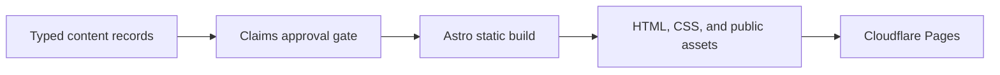

# Architecture

The portfolio is a static Astro site. Typed content and an explicit claims ledger are validated before Astro renders public pages and assets.

## Components

- `apps/site`: static routes, components, styles, metadata, typed content records, publication gates, and browser checks. `apps/site/site.config.mjs` holds the production origin and the public route list; the sitemap, `robots.txt`, canonical URLs, and the static-site validator all read it.
- `scripts`: validation, audits, and sanitized notifications.
- `docs`: content brief, operating rules, architecture, and release runbooks.

## Public routes

Home is curated: a hero, a "now" row, six work cards, recent news, and selected publications. About holds the story, path, colleague quotes, problem-solving charts, skills, honors, and photos; Publications holds every entry with BibTeX. Case studies live under `/research/` and `/projects/` and share `CaseLayout`, which adds a reading-progress bar and an "On this page" rail. The CV at `/cv/` prints to one page; the downloadable PDF is the owner's résumé, copied in by hand. Retired addresses redirect through `public/_redirects`, and the static-site validator fails the build if a redirect points at a page or file that does not exist.

Interactive components (`NetBenchExplorer`, `GuardedReplay`, `KafkaCompare`, `PublicationList`, `RatingChart`, `ReadingAids`) render a complete static version at build time; their `<script>` blocks only add interaction. Astro bundles each script into `/_astro/`, and `vite.build.assetsInlineLimit: 0` keeps small ones from being inlined, so the content security policy in `public/_headers` can allow `script-src 'self'` with no inline exception. The explorer's data comes from a build-time endpoint, `src/pages/data/hpn-qa-v5.json.ts`. Rating charts read snapshots in `src/data/`. The home page carries Person structured data as JSON-LD, which browsers do not execute.

## Trust boundaries

Raw career sources remain outside the repository. Published content is accepted only when every referenced claim is approved and public-safe. The site has no visitor-input, storage, cookie, analytics, or server-side execution path.

## Failure behavior

Invalid or unapproved records fail content validation. Missing routes, assets, metadata, sitemap entries, redirect targets, or résumé files fail the static-site validator, as do inline scripts, more than 30 KB of compressed script on a page, a social image over 200 KB, visible text that describes the site's internal review process, and any figure in visible text that no approved claim contains. Cloudflare Pages can restore a prior deployment or deploy a reverted approved commit if a release fails.
