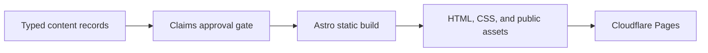

# Architecture

The portfolio is a static Astro site. Typed content and an explicit claims ledger are validated before Astro renders public pages and assets.

## Components

- `apps/site`: static routes, components, styles, metadata, typed content records, publication gates, and browser checks. `apps/site/site.config.mjs` holds the production origin and the public route list; the sitemap, `robots.txt`, canonical URLs, and the static-site validator all read it.
- `scripts`: validation, audits, and sanitized notifications.
- `docs`: content brief, operating rules, architecture, and release runbooks.

## Public routes

Home carries the overview in the order a reviewer reads it: bio, news, research, publications, experience and education, then skills, honors, and service. Detail pages cover NetBench, guarded orchestration, and the Agentic Data Transfer Optimizer under `/research/`, Kona Token Trade under `/projects/`, and the CV at `/cv/`, whose print stylesheet produces `resume.pdf`. Pages that existed before the October 2026 redesign redirect through `public/_redirects`, and the static-site validator fails the build if a redirect points at a page that does not exist.

The site ships no JavaScript. `public/_headers` sets a content security policy that allows only same-origin styles, fonts, and images, and Astro keeps stylesheets external so the policy needs no inline exception. The home page carries Person structured data as JSON-LD, which browsers do not execute.

## Trust boundaries

Raw career sources remain outside the repository. Published content is accepted only when every referenced claim is approved and public-safe. The site has no visitor-input, storage, cookie, analytics, or server-side execution path.

## Failure behavior

Invalid or unapproved records fail content validation. Missing routes, assets, metadata, sitemap entries, redirect targets, or résumé files fail the static-site validator, as do scripts, a social image over 200 KB, and visible text that describes the site's internal review process. Cloudflare Pages can restore a prior deployment or deploy a reverted approved commit if a release fails.
