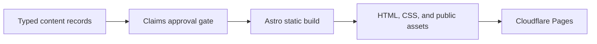

# Architecture

The portfolio is a static Astro site. Typed content and an explicit claims ledger are validated before Astro renders public pages and assets.

## Components

- `apps/site`: static routes, components, styles, metadata, typed content records, publication gates, and browser checks. `apps/site/site.config.mjs` holds the production origin and the public route list; the sitemap, `robots.txt`, canonical URLs, and the static-site validator all read it.
- `scripts`: validation, audits, and sanitized notifications.
- `docs`: content brief, operating rules, architecture, and release runbooks.

## Public routes

Home presents positioning and strongest evidence. Work & Research includes the Guarded Scientific Model Orchestration, Kona Token Trade, and Bangla Sign Language Recognition case studies plus the Agentic Data Transfer Optimizer research-in-progress page. Experience, About, Résumé, and Contact complete the professional narrative.

## Trust boundaries

Raw career sources remain outside the repository. Published content is accepted only when every referenced claim is approved and public-safe. The site has no visitor-input, storage, cookie, analytics, or server-side execution path.

## Failure behavior

Invalid or unapproved records fail content validation. Missing routes, assets, metadata, sitemap entries, or résumé files fail the static-site validator. Cloudflare Pages can restore a prior deployment or deploy a reverted approved commit if a release fails.
